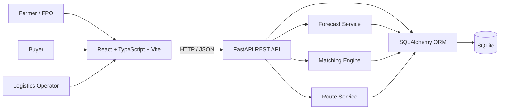
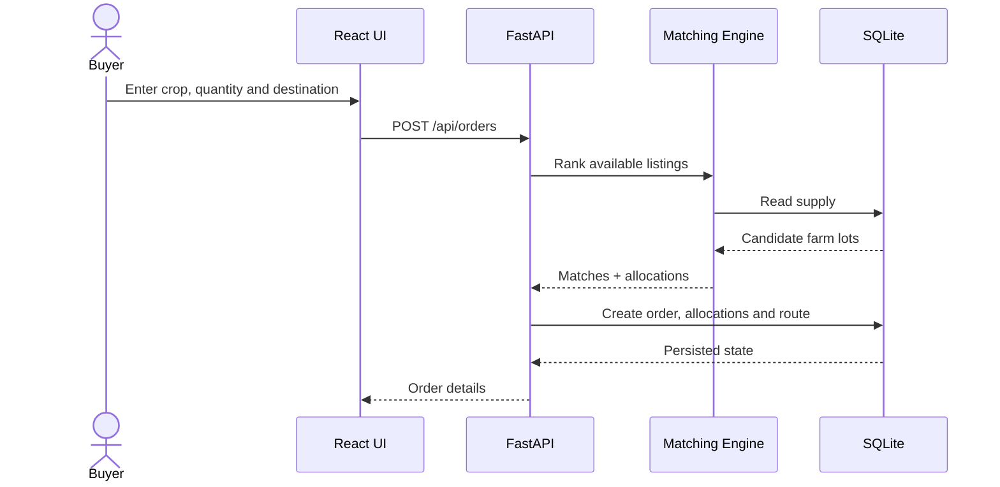

# FasalBridge AI — Architecture

## System Context

FasalBridge AI is a full-stack farm-to-market coordination platform with a React + TypeScript frontend, FastAPI REST backend, SQLAlchemy persistence, SQLite storage, and decision-support logic for forecasting, matching, and route planning.



## Repository Architecture

```text
FasalBridge-application/
├── .env.example
├── README.md
├── ARCHITECTURE.md
├── backend/
│   ├── main.py
│   ├── requirements.txt
│   └── fasalbridge.db
└── frontend/
    ├── index.html
    ├── package.json
    ├── package-lock.json
    ├── vite.config.ts
    └── src/
        ├── main.tsx
        └── style.css
```

The current backend keeps application models, schemas, seed data, API endpoints, and decision-support logic in `backend/main.py`. The frontend is currently concentrated in `frontend/src/main.tsx` with global styles in `style.css`.

## Data Model

```mermaid
erDiagram
    USER ||--o{ LISTING : creates
    USER ||--o{ ORDER : places
    ORDER ||--o{ ALLOCATION : contains
    LISTING ||--o{ ALLOCATION : fulfills
    ORDER ||--o| ROUTE : generates

    USER { int id PK; string name; string email; string password; string role; string location }
    LISTING { int id PK; int farmer_id FK; string crop; float quantity; float available_quantity; float price; string location; string grade; date harvest_date }
    ORDER { int id PK; int buyer_id FK; string crop; float quantity; string delivery_location; date required_date; string status; float total_price }
    ALLOCATION { int id PK; int order_id FK; int listing_id FK; float quantity; float price }
    DEMAND { int id PK; string crop; int week; float demand; string location }
    ROUTE { int id PK; int order_id FK; string status; float distance; int stops; float load }
```

## Buyer Order Flow



## Decision Support

### Demand forecasting
Historical weekly demand is loaded for a crop. The MVP attempts a linear regression prediction and falls back to a recent-demand baseline if model execution is unavailable. The output includes predicted demand, change, confidence, recommendation, and a decision-support disclaimer.

### Matching
Listings are filtered by crop and availability, optionally by quality, then ranked using geographic proximity, price competitiveness, and quality preference. Quantity is allocated across ranked listings until the requirement is filled or supply is exhausted.

### Routing
A pooled route is created from matched allocations. The current optimization endpoint represents a transparent nearest-neighbor sequencing approach for the demo rather than a production vehicle-routing solver.

## API Boundary

```text
GET    /api/health
POST   /api/auth/login
GET    /api/farmers
GET    /api/farmers/{id}
GET    /api/produce
POST   /api/produce
PUT    /api/produce/{id}
DELETE /api/produce/{id}
POST   /api/match
POST   /api/orders
GET    /api/orders
GET    /api/orders/{id}
PATCH  /api/orders/{id}/status
GET    /api/forecast/{crop}
POST   /api/forecast
GET    /api/routes
POST   /api/routes/optimize
PATCH  /api/routes/{id}/status
GET    /api/analytics
```

## Production Evolution

For a production system, split `main.py` into API routers, models, schemas, services, repositories, configuration, migrations, and tests. Replace SQLite with PostgreSQL, add Alembic migrations, secure authentication, proper authorization, observability, CI/CD, model evaluation, and a real geospatial routing/optimization service.

> This document describes the current MVP and clearly separates implemented components from recommended production architecture.
